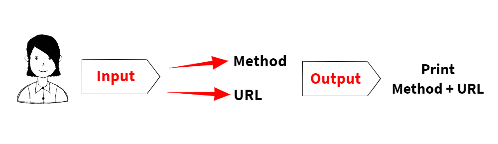

# LAB - Class 28

## Topic: Props and State

### Author: Muhammed Tommalieh

### Links and Resources

- [submission PR](https://github.com/401-advanced-javascript-tommalieh/caps/pull/6)

#### Running the app

- `npm start`

#### Tests

- Visual tests were preformed
- Enzyme and lint tests were preformed

#### UML

